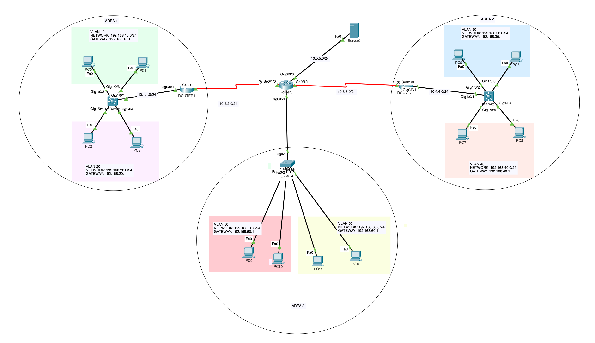

# Multi-Area OSPF Network with VLANs, ROAS, and Centralized DHCP

## Project Overview

This project demonstrates a complex enterprise-style network topology featuring three distinct LAN environments interconnected via a multi-area OSPF backbone. It incorporates Layer 3 switching, Router-on-a-Stick (ROAS), and centralized DHCP services using IP Helper addresses.

## Features

  * **VLAN Segmentation:** Organized traffic into 6 distinct VLANs (10, 20, 30, 40, 50, 60).
  * **Inter-VLAN Routing:** Achieved through SVI (Switch Virtual Interfaces) on L3 switches and Sub-interfaces (ROAS) on L2/Router boundaries.
  * **Dynamic Routing:** Multi-area **OSPF (Open Shortest Path First)**:
      * **Area 0:** Core backbone connecting Routers 0, 1, and 2.
      * **Area 1, 2, 3:** Stub/Access areas for regional LANs.
  * **Centralized Services:** A dedicated DHCP server provides dynamic IP addressing across all VLANs via `ip helper-address` configurations.


## Network Topology


### Address Space

| VLAN | Network | Gateway | Description |
| :--- | :--- | :--- | :--- |
| 10 | 192.168.10.0/24 | 192.168.10.1 | Network 1 - Dept A |
| 20 | 192.168.20.0/24 | 192.168.20.1 | Network 1 - Dept B |
| 30 | 192.168.30.0/24 | 192.168.30.1 | Network 2 - Dept C |
| 40 | 192.168.40.0/24 | 192.168.40.1 | Network 2 - Dept D |
| 50 | 192.168.50.0/24 | 192.168.50.1 | Network 3 - Dept E (ROAS) |
| 60 | 192.168.60.0/24 | 192.168.60.1 | Network 3 - Dept F (ROAS) |


## Configuration Highlights

### 1\. Multi-Area OSPF Logic

The network uses OSPF Process ID 1. Router 0 acts as the central hub in Area 0, while Router 1 and Router 2 act as Area Border Routers (ABRs) connecting Area 1 and Area 2 respectively.

### 2\. Router-on-a-Stick (Area 3)

For the L2 Switch environment, sub-interfaces were created on the router to handle tagging:

```bash
interface g0/0/1.50
 encapsulation dot1Q 50
 ip address 192.168.50.1 255.255.255.0
```

### 3\. Centralized DHCP & IP Helper

To allow DHCP discover broadcasts to cross router boundaries to the server at `10.5.5.2`, IP helper addresses were applied to all gateway interfaces:

```bash
interface vlan 10
 ip helper-address 10.5.5.2
```

## How to Use

1.  Review the configuration files in the `/configs` folder.
2.  If using Cisco Packet Tracer, open the `.pkt` file in the `/lab_file` folder to see the live simulation.
3.  Ping tests and `show ip route` commands can be used to verify full end-to-end connectivity.
